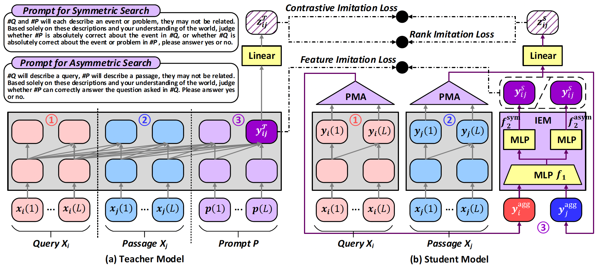

<<<<<<< HEAD
# D2LLM
=======
# D2LLM: Decomposed and Distilled Large Language Models for Semantic Search

This is the Pytorch implementation of D2LLM in the ACL'24 paper: D2LLM: Decomposed and Distilled Large Language Models for Semantic Search.

<b>Figure 1.</b> The network architecture of D2LLM.

## Requirements

* Ubuntu OS
* python==3.10
* torch==2.0.1
* cuda==11.7
* transformers==4.37.0
* deepspeed==0.14.2
* flash-attn==2.3.6
* peft==0.7.0

Dependencies can be installed by:

    pip install -r requirements.txt

The overall directory structure is as follows:

    ${CODE_ROOT}
        ......
        |-- preprocess
            |-- save_hardneg_bm25.py
            |-- save_hardneg_bi.py
            |-- save_logits.py
        |-- dataset
        		|-- dataset.py
        |-- model
        		|-- pro_model.py
        |-- utils
        		|-- common_utils.py
        |-- train.py
        |-- train.sh

## Data preparetion

The six datasets (SNLI-zh, NLI-zh, T2Ranking, DuReader, cMedQA2 and mMARCO) used in this paper can be downloaded from the following links:

* [SNLI-zh](https://huggingface.co/datasets/shibing624/snli-zh)
* [NLI-zh](https://huggingface.co/datasets/shibing624/nli_zh)
* [T2Ranking](https://github.com/THUIR/T2Ranking)
* [DuReader](https://github.com/baidu/DuReader)
* [cMedQA2](https://github.com/zhangsheng93/cMedQA2)
* [mMARCO](https://huggingface.co/datasets/unicamp-dl/mmarco)

Before performing training, we mine hard negatives through BM25 and other bi-encoder evaluations using scripts save_hardneg_bm25.py and save_hardneg_bi.py. Then, we use the script save_logits.py to perform correlation scoring on in-batch negatives and hard negatives through LLM. 

## Train

To perform training, just adjust the parameters and run:

    sh train.sh

## Evaluate

Evaluation can be done throw the mteb tools. Note that the cosine similarity should be replace by the IEM module.

## Citation

    @inproceedings{
    anonymous2024dllm,
    title={D2{LLM}: Decomposed and Distilled Large Language Models for Semantic Search},
    author={Anonymous},
    booktitle={The 62nd Annual Meeting of the Association for Computational Linguistics},
    year={2024}
    }
>>>>>>> init
